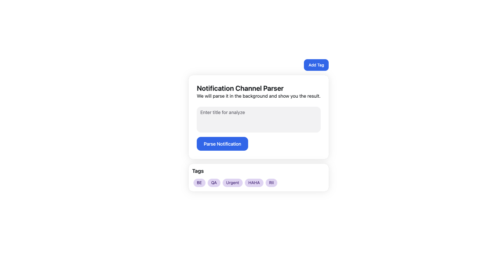
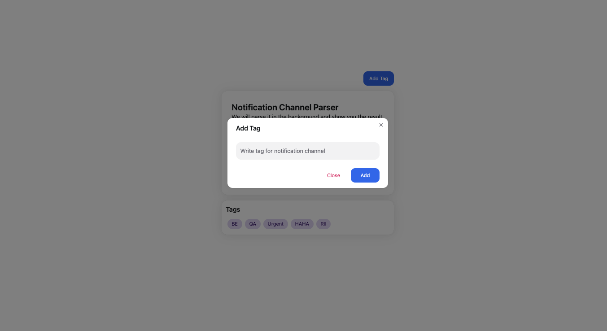
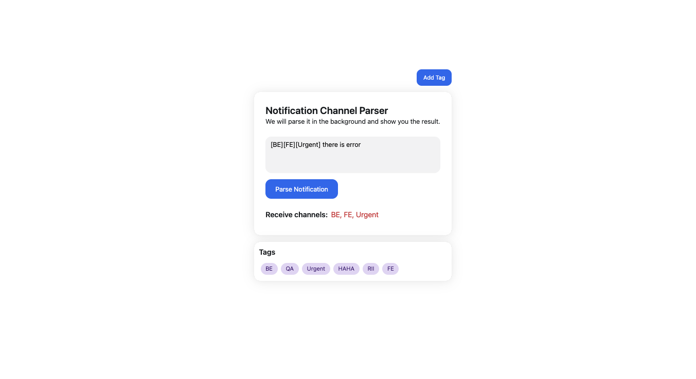

# Notification Channel Parser 📡

## 🌟 Overview

Notification Channel Parser is a robust .NET Core API designed to parse and manage notification tags efficiently. The project provides a flexible solution for extracting and handling notification channels from raw text input.

## 🚀 Features

- **Dynamic Channel Parsing**: Extract relevant notification channels using regex
- **File-based Tag Management**: Read and write tags to persistent storage
- **Flexible API Endpoints**: Support for parsing, reading, and writing tags
- **Cross-Platform Compatibility**: Built with .NET Core

## 📋 Prerequisites

- [.NET SDK 6.0+](https://dotnet.microsoft.com/download)
- [Visual Studio](https://visualstudio.microsoft.com/) or [Visual Studio Code](https://code.visualstudio.com/)
- Git

## 🔧 Installation

### 1. Clone the Repository

```bash
git clone git@github.com:vannsoklay/NotificationChannelParserCSharpwithDotNet.git
cd NotificationChannelParserCSharpwithDotNet
```

### Run the Backend

```bash
cd */NCP.API/
dotnet restore
dotnet run --urls http://localhost:5062
```

### Run the Client

```bash
cd */client/
npm install --force
npm run dev
```

## 💾 File Store Data
- **Folder**: `/NCP.API/Files/tags.txt`


## 🌐 API Endpoints

### Parse Notification

- **Endpoint**: `POST /api/notification/parse`
- **Description**: Extract notification channels from input text
- **Request Body**: 
  ```
  "[BE][QA][Urgent] System error detected"
  ```
- **Response**:
  ```
  Receive channels: BE, QA, Urgent
  ```
```bash
curl --location 'http://localhost:5062/api/notification/parse' \
--header 'Content-Type: application/json' \
--data '"[BE][QA][HAHA][Urgent] there is error"'
```

### Read Tags

- **Endpoint**: `GET /api/notification/tags`
- **Description**: Retrieve all stored tags
- **Response**:
  ```json
  ["BE", "QA", "Urgent", "HAHA"]
  ```

```bash
curl --location 'http://localhost:5062/api/notification/tags'
```

### Write Tag

- **Endpoint**: `POST /api/notification/tag`
- **Description**: Add a new tag to storage
- **Request Body**: 
  ```
  "NewTag"
  ```
- **Response**:
  ```
  Value 'NewTag' added to file tags
  ```
```bash
curl --location 'http://localhost:5062/api/notification/tag' \
--header 'Content-Type: application/json' \
--data '"Urgent"'
```

## 🧪 Testing

Run unit tests:
```bash
dotnet test
```

## 🔒 Configuration

Configure notification channels in `appsettings.json`:
```json
{
  "ConnectionStrings": {
    "DefaultConnection": "Server=localhost;Database=YourDatabase;Trusted_Connection=True;MultipleActiveResultSets=true"
  },
  "Logging": {
    "LogLevel": {
      "Default": "Information",
      "Microsoft.AspNetCore": "Warning"
    }
  },
  "AllowedHosts": "*"
}
```

## 📦 Dependencies

- Microsoft.AspNetCore.Mvc
- System.Text.RegularExpressions
- Microsoft.Extensions.Logging



